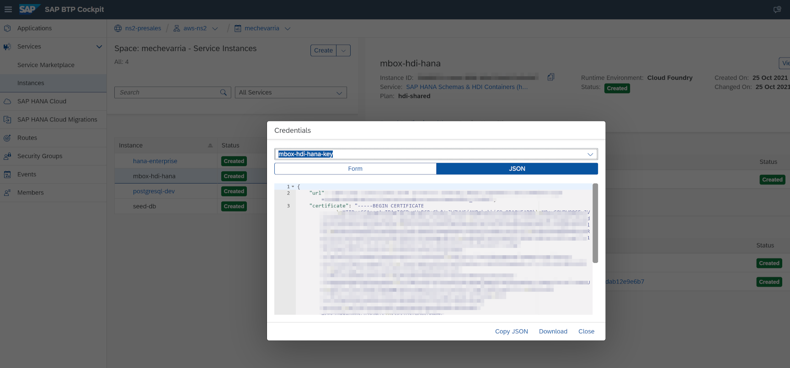

# mbox to hana

[Node.js](https://nodejs.org/) utility to parse email mbox files and persist to [SAP HANA](https://www.sap.com/products/hana.html). For quick testing and deployment, take advantage of the [SAP HDI Container](https://developers.sap.com/tutorials/hana-trial-advanced-analytics.html#3864a79f-ab79-4cf2-b410-b5716d6ff0c8) for creating a silo-ed database

### Requirements

* A an email export named `export.mbox` to be read in the main directory of this project. This is the type of export that is typical of a [Google Takeout](https://takeout.google.com/)

* The project database can de deployed on the SAP Business Technology Platform if the [Cloud Foundry CLI](https://docs.cloudfoundry.org/cf-cli/install-go-cli.html) is installed

* Login to your [SAP Business Technology Platform](https://www.sap.com/products/business-technology-platform.html) space with the `cf-login.sh` script. You will need to add the `CP_USER` and `CP_PASSWORD` environment variables and edit the script for organization and project space

* A [SAP HANA platform service](https://developers.sap.com/tutorials/haas-dm-deploying-haas.html) must be deployed for the project DB to be deployed as a container

* You can deploy the [SAP HANA HDI Container](https://help.sap.com/viewer/4505d0bdaf4948449b7f7379d24d0f0d/2.0.05/en-US/e28abca91a004683845805efc2bf967c.html) with the `cf-db.sh` script

* Once the DB container is deployed you will need credentials to access it. Create a file named `service-key.json` with the SAP HANA database [connection properties](https://help.sap.com/viewer/f1b440ded6144a54ada97ff95dac7adf/2.10/en-US/4fe9978ebac44f35b9369ef5a4a26f4c.html)

You can also copy and paste a service key from a SAP HANA instance deployed in [SAP Business Technology Platform](https://www.sap.com/products/business-technology-platform.html)



Example:
```json
{
  "host": "zeus.hana.prod.some.region.com",
  "port": 555666,
  "user": "MBOX_SCHEMA_RT",
  "password": "some-long-password-with-numbers-888-AND-CAPS",
  "encrypt": true
}
```

* Next install the dependencies to run the script with `npm install`

* Finally run the script to load the email export with `npm run start`